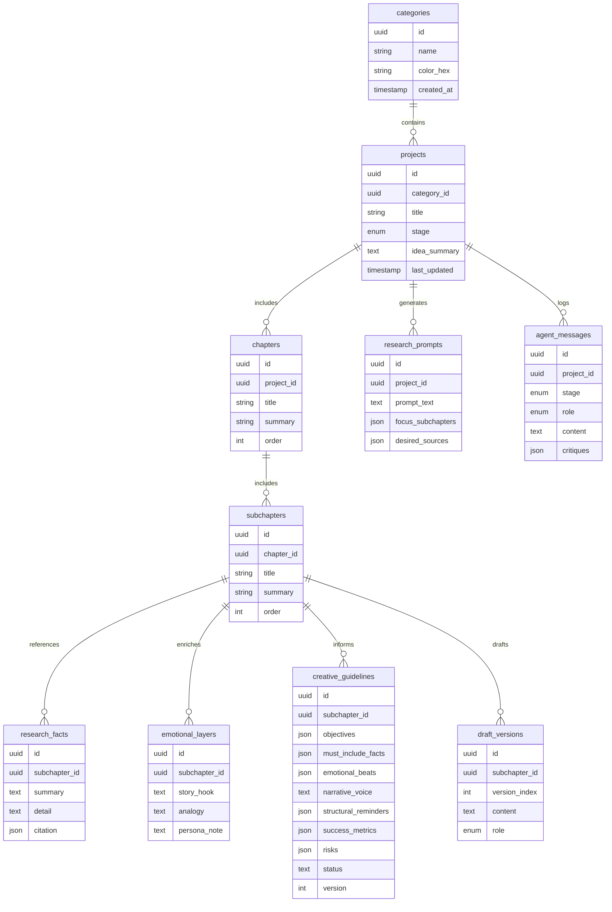

# Phase 2 – ERD Snapshot

This ERD models the artifacts described by the Phase 2 schemas. Vector embeddings (for research facts) and analytics snapshots are stored in auxiliary tables aligned with the `ProjectProgressSnapshot` object.
